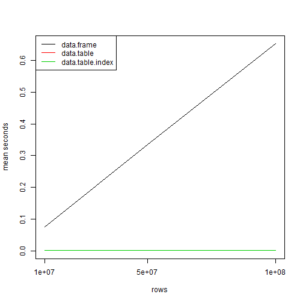

R can handle fairly big data working on a single machine, 2B (2E9) rows and couple of columns require about 100 GB of memory.  
This is already well enough to care about performance.  
With this post I'm going discuss scalability of filter queries.  

----

The *index* has been introduced to data.table in 1.9.4. It is also known as *secondary keys*. Unlike with *key*, a single data.table can have multiple indexes.  
It basically store additional vector of rows order as data.table attribute.  
Sounds really simple, it is even better because user does not have use them in any special way - use of index is automatically handled in data.table.  
And the performance gains are big enough to write a post on that.  

----

What you should know about data.table index (as of 2015-11-23):  

- index will be used when subsetting dataset with `==` or `%in%` on a single variable
- by default if *index* for a variable is not present on filtering, it is automatically created and used
- indexes are lost if you change the order of data
- you can check if you are using index with `options(datatable.verbose=TRUE)`

Above features are likely to be improved in future.  

- also important to mention, there is an open FR to automatically utilize index when doing *unkeyed join* (new feature in 1.9.6) - using new *on* argument. So in future version user will be able to leverage mighty performance of indexes for joining datasets.  

----

Brief look at the structure:


```r
library(data.table)
```

```
## data.table 1.10.4
```

```
##   The fastest way to learn (by data.table authors): https://www.datacamp.com/courses/data-analysis-the-data-table-way
```

```
##   Documentation: ?data.table, example(data.table) and browseVignettes("data.table")
```

```
##   Release notes, videos and slides: http://r-datatable.com
```

```r
op = options(datatable.verbose=TRUE,
             datatable.auto.index=TRUE)
dt = data.table(a=letters[c(3L,1L,2L)])
set2keyv(dt, "a")
```

```
## Warning: set2key() will be deprecated in the next relase. Please use
## setindex() instead.
```

```
## forder took 0 sec
```

```r
attr(dt, "index")
```

```
## integer(0)
## attr(,"__a")
## [1] 2 3 1
```

```r
dt[a=="b"]
```

```
## Using existing index 'a'
## Starting bmerge ...done in 0 secs
```

```
##    a
## 1: b
```

```r
dt[a %in% c("b","c")]
```

```
## Using existing index 'a'
## Starting bmerge ...done in 0 secs
```

```
##    a
## 1: c
## 2: b
```

```r
options(op)
```

----

So how it looks in practice. I will compare base R data.frame, data.table and indexed data.table. You can try other tool, I doubt if you will get better performance in any other tool, not just other R package.  
The volumes tested are 1e7, 5e7 and 1e8 rows. Should works fine on 8GB memory.  

Some helper function.  


```r
# easy control usage of index and verbose
with_index = function(x, auto.index=TRUE, verbose=TRUE){
    op=options("datatable.auto.index"=auto.index, "datatable.verbose"=verbose)
    on.exit(op)
    x
}
```

### 1e7


```r
set.seed(123)
n = 1e7
dt = data.table(high = sample(n*0.9, n, TRUE), normal = sample(n*0.1, n, TRUE), low = sample(10, n, TRUE), value = rnorm(n))
df = as.data.frame(dt)
set2keyv(dt, "high")
```

```
## Warning: set2key() will be deprecated in the next relase. Please use
## setindex() instead.
```

```r
high.filter = sample(dt$high, 1L)
df.r = df[df$high==high.filter,]
dt.r = with_index(dt[high==high.filter])
```

```
## Using existing index 'high'
## Starting bmerge ...done in 0 secs
```

```r
dti.r = with_index(dt[high==high.filter], auto.index = FALSE)
```

```
## Using existing index 'high'
## Starting bmerge ...done in 0 secs
```

```r
all.equal(as.data.table(df.r), dt.r) && all.equal(dt.r, dti.r)
```

```
## [1] TRUE
```

```r
library(microbenchmark)
mb = list()
mb[["1e7"]] = microbenchmark(times = 10L,
    data.frame = df[df$high==high.filter,],
    data.table = with_index(dt[high==high.filter], auto.index = FALSE, verbose = FALSE),
    data.table.index = with_index(dt[high==high.filter], auto.index = TRUE, verbose = FALSE)
)
print(mb[["1e7"]])
```

```
## Unit: microseconds
##              expr       min        lq       mean     median        uq
##        data.frame 63972.697 66070.538 74849.7487 69698.7480 73725.698
##        data.table   486.278   507.407   671.7627   516.4620   928.485
##  data.table.index   480.240   484.164   575.1110   496.6915   671.008
##         max neval cld
##  123423.715    10   b
##     968.328    10  a 
##     853.928    10  a
```

### 5e7


```
## Warning: set2key() will be deprecated in the next relase. Please use
## setindex() instead.
```

```
## Unit: microseconds
##              expr        min         lq        mean      median         uq
##        data.frame 290415.823 302830.215 335838.3481 315533.0235 344821.758
##        data.table    503.483    529.744    701.7967    690.0245    899.205
##  data.table.index    478.731    492.013    639.7972    500.4645    864.190
##         max neval cld
##  472348.186    10   b
##     911.279    10  a 
##     900.412    10  a
```

### 1e8


```
## Warning: set2key() will be deprecated in the next relase. Please use
## setindex() instead.
```

```
## Unit: microseconds
##              expr        min         lq        mean      median         uq
##        data.frame 579866.638 605049.188 652961.8963 609197.0285 731139.424
##        data.table    490.504    509.218    674.2683    549.8165    875.661
##  data.table.index    471.486    485.372    698.9292    571.8515    858.456
##         max neval cld
##  801752.468    10   b
##     991.269    10  a 
##    1339.601    10  a
```

## Timing summary

How fast is data.table index and how it scales?  


```
## mean seconds
```

```
##                expr    1e7    5e7    1e8
## 1:       data.frame 0.0748 0.3358 0.6530
## 2:       data.table 0.0007 0.0007 0.0007
## 3: data.table.index 0.0006 0.0006 0.0007
```

```
## relative
```

```
##                expr        1e7        5e7      1e8
## 1:       data.frame 124.666667 559.666667 932.8571
## 2:       data.table   1.166667   1.166667   1.0000
## 3: data.table.index   1.000000   1.000000   1.0000
```



On the 1e8 rows the indexed data.table solution is ~932.86 times faster than data.frame and ~1.00 times faster than non-index data.table.

----

## Scaling data.table index even further for big data?  

If you don't have a single machine good enough to handle a data.table in memory you can stil preserve the data.table's index performance.  
You need to split your data into separate instances of R, index each of them. Then just rbind results queried from each instance.  
That is pretty easy with [Rserve](https://github.com/s-u/Rserve), but since this is a topic for separate post I will leave you with basic working example.  


```r
library(Rserve)
```

```
## Error in library(Rserve): there is no package called 'Rserve'
```

```r
library(RSclient)
```

```
## Error in library(RSclient): there is no package called 'RSclient'
```

```r
port = 6311:6312
```


```r
# start nodes
sapply(port, function(port) Rserve(debug = FALSE, port = port, args = c("--no-save")))
```

```
## Error in FUN(X[[i]], ...): could not find function "Rserve"
```

```r
# connect nodes
rscl = lapply(setNames(port, port), function(port) RS.connect(port=port))
```

```
## Error in FUN(X[[i]], ...): could not find function "RS.connect"
```


```r
# populate data, 5M rows in each node
qcall = quote({
    stopifnot(suppressPackageStartupMessages(require("data.table", character.only = TRUE, quietly = TRUE)))
    set.seed(123)
    n = 5e6
    x <- data.table(high = sample(n*0.9, n, TRUE), normal = sample(n*0.1, n, TRUE), low = sample(10, n, TRUE), value = rnorm(n))
    high.filter <- sample(x$high, 1L)
    set2keyv(x, "high")
    TRUE
})
sapply(rscl, RS.eval, qcall, lazy=FALSE)
```

```
## Error in match.fun(FUN): object 'RS.eval' not found
```


```r
# query using index, capture data.table verbose messages
qcall = quote({
    op = options(datatable.auto.index=TRUE, datatable.verbose=TRUE)
    prnt = capture.output(r <- x[high==high.filter])
    options(op)
    list(verbose = prnt, results = r)
})
l = lapply(rscl, RS.eval, qcall, lazy=FALSE)
```

```
## Error in match.fun(FUN): object 'RS.eval' not found
```

```r
# datatable.verbose from each node
invisible(lapply(lapply(l, `[[`, "verbose"), cat, sep="\n"))
```

```r
# results from each node
lapply(l, `[[`, "results")
```

```
## $`6311`
## NULL
## 
## $`6312`
## NULL
```


## Reproducibility

You can find script of blog post in Rmarkdown format in the blog github repo.  
If you have any comments feel free to put them into github issue.  
